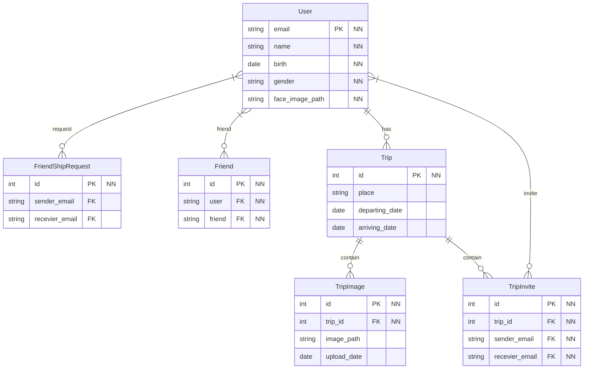

# 가치 백엔드 리포지토리
Trip together , Share images easily ! 

인공지능 기반 여행 어플리케이션 GACHI입니다.

# Stack

  
  
  
  
  

# Architecture

# ERD

```mermaid 
erDiagram

User{
    string  email       PK  "NN"
    string  name            "NN"
    date    birth           "NN"
    string  gender          "NN"
    string  face_image_path "NN"
}

FriendShipRequest{
    int     id                  PK     "NN"
    string  sender_email        FK
    string  recevier_email      FK
}

Friend{
    int     id      PK  "NN"
    string  user    FK  "NN"
    string  friend  FK  "NN"
}

Trip{
    int     id              PK  "NN"
    string  place
    date    departing_date
    date    arriving_date

}

TripInvite{
    int     id              PK  "NN"
    int     trip_id         FK  "NN"
    string  sender_email    FK  "NN"
    string  recevier_email  FK  "NN"
}

TripImage{
    int     id          PK  "NN"
    int     trip_id     FK  "NN"
    string  image_path      
    date    upload_date 
}

User ||--o{ Trip : "has"
Trip ||--o{ TripImage : "contain"
Trip ||--o{ TripInvite : "contain"
User }|--o{ FriendShipRequest : "request"
User }|--o{ TripInvite : "invite"
User }|--o{ Friend : "friend"
```